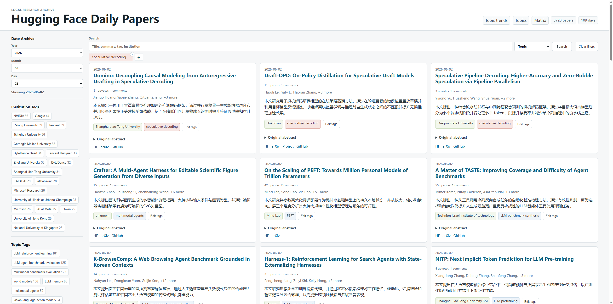
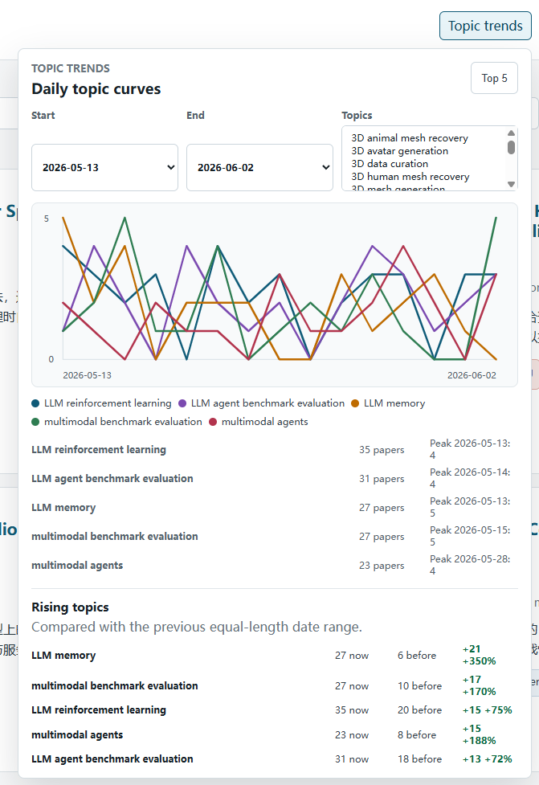
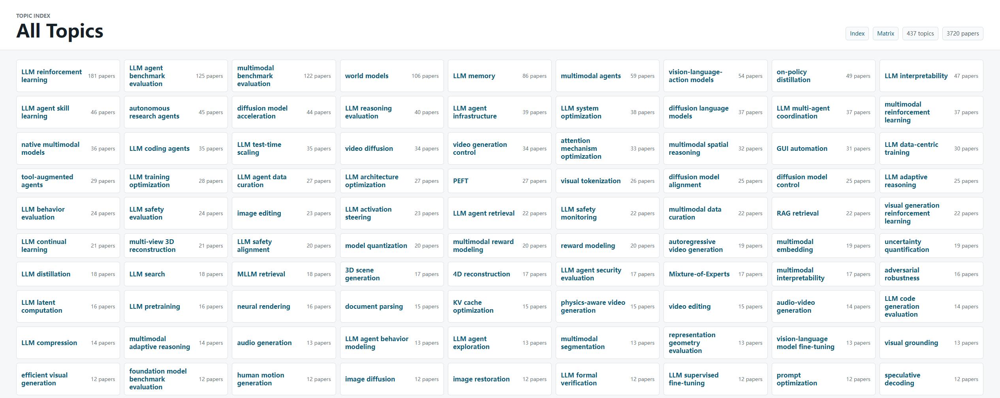

# Hugging Face Daily Papers Archive

[中文](README.md) | English

This project fetches Hugging Face Daily Papers, generates Chinese one-sentence summaries plus institution/topic tags with an OpenAI-compatible model, and builds a local static archive website.

Main features:

- Daily paper fetching, summary generation, and tag generation.
- Static website with date archive, global search, field-specific search, and tag filters.
- Topic trend charts, rising topic ranking, and an Institution x Topic matrix.
- Local admin mode for manually correcting wrong institution/topic tags.
- Project-level topic and institution merge-review skills. Alias writes require explicit human approval.

## Quick Preview

[Open the live Hugging Face Daily Papers site](https://senmo996.github.io/hugginggface_daily_paper/)

The repository keeps a generated `site/` snapshot. After `git clone`, open `site/index.html` directly to preview the example website; later locally regenerated `site/` content is not synced to GitHub.

## Screenshots

The homepage shows paper cards by date with search and tag filtering:



The topic trend panel tracks research-direction changes across a selected date range:



The Topics page lists historical topics and their paper counts:



The Institution x Topic matrix shows cross-distribution between institutions and research directions:


## Setup

```powershell
python -m venv .venv
.\.venv\Scripts\Activate.ps1
python -m pip install -e ".[dev]"
Copy-Item .env.example .env
```

Edit `.env`:

```text
OPENAI_BASE_URL=https://api.openai.com/v1
OPENAI_API_KEY=your-key
OPENAI_MODEL=your-model
```

Any OpenAI-compatible endpoint can be used if it supports chat completions and JSON output.

## Daily Workflow

Fetch one date:

```powershell
python -m hf_daily fetch --date 2026-05-28
```

Generate summaries and tags:

```powershell
python -m hf_daily generate --date 2026-05-28
```

Build the static site:

```powershell
python -m hf_daily build
```

Run the full workflow:

```powershell
python -m hf_daily run --date 2026-05-28
```

Open `site/index.html` after building.

## Local Admin Mode

Start the local admin server:

```powershell
python -m hf_daily admin
```

Open the printed local URL, click `Edit tags` on a paper card, update the tags, and click `Save draft`. Changes are written to `data/tags/tag_overrides.json`, and the site is rebuilt automatically. The original `data/daily/*.json` files are not rewritten.

Tag inputs support autocomplete from existing topic and institution tags.

## Website Features

The homepage defaults to the latest generated date that contains papers. `Date Archive` only exposes dates with at least one paper; empty weekend dates are ignored during site build.

Search and filtering:

- Full-field search by default.
- Optional title-only, topic-only, institution-only, and other field-specific search.
- Search results cover all generated dates, not only the selected date.
- Institution/topic filters also search across all generated dates.

Analytics:

- Topic trend chart with the top 5 topics by default.
- User-selected topic curves.
- Rising topic ranking by comparing the current range with the previous range.
- Institution x Topic matrix on a separate page.

## Local Data

- `data/raw/YYYY-MM-DD.json`: raw Hugging Face API response.
- `data/daily/YYYY-MM-DD.json`: normalized papers with generated summaries and tags; this directory is committed as persistent state for resumable GitHub Actions runs.
- `data/tags/topics.json`: local topic tag library.
- `data/tags/institutions.json`: local institution tag library.
- `data/tags/topic_aliases.json`: reviewed topic merge aliases.
- `data/tags/institution_aliases.json`: reviewed institution merge aliases.
- `data/tags/tag_overrides.json`: manual per-paper tag corrections from admin mode.
- `site/`: locally generated static website with the homepage, matrix page, and shared static assets; this directory is no longer synced to GitHub.

## Codex Skills

This repository includes two project-level Codex skills under `.codex/skills/`.

### topic-merge-review

Use this skill when proposing or applying topic tag merges.

```powershell
python .codex\skills\topic-merge-review\scripts\suggest_topic_merges.py --root .
```

Workflow:

1. Generate a review packet only.
2. Wait for explicit human approval with exact `alias -> canonical` pairs.
3. Write only `data/tags/topic_aliases.json`.
4. Do not rewrite `data/daily/*.json`.

### institution-merge-review

Use this skill when proposing or applying institution tag merges.

```powershell
python .codex\skills\institution-merge-review\scripts\suggest_institution_merges.py --root .
```

Workflow:

1. Generate a review packet only.
2. Wait for explicit human approval with exact `alias -> canonical` pairs.
3. Write only `data/tags/institution_aliases.json`.
4. Do not rewrite `data/daily/*.json`.
5. Do not merge `Unknown` into real institutions.

## Windows Task Scheduler Example

```powershell
$Action = New-ScheduledTaskAction `
  -Execute "powershell.exe" `
  -Argument "-NoProfile -ExecutionPolicy Bypass -Command `"cd D:\Github\huggingface_daily; .\.venv\Scripts\Activate.ps1; python -m hf_daily run`""

$Trigger = New-ScheduledTaskTrigger -Daily -At 9:00AM

Register-ScheduledTask `
  -TaskName "HuggingFaceDailyPapers" `
  -Action $Action `
  -Trigger $Trigger `
  -Description "Fetch Hugging Face daily papers and rebuild the static archive."
```

The default date uses the local Asia/Shanghai date. Pass `--date YYYY-MM-DD` for a fixed date.

## Daily GitHub Actions Automation

The repository includes `.github/workflows/daily.yml`. Every day at 09:15 Asia/Shanghai time it:

1. fetches and generates paper data through the previous day;
2. commits `data/daily/` and updated tag data back to the default branch so failed runs can resume;
3. builds the static site and deploys it to GitHub Pages.

Complete these repository settings before the first run:

1. Create `OPENAI_API_KEY` and `OPENAI_MODEL` under `Settings -> Secrets and variables -> Actions`. Also create `OPENAI_BASE_URL` when using a compatible endpoint. Never commit credentials.
2. Select `GitHub Actions` under `Settings -> Pages -> Build and deployment -> Source`.
3. After pushing the changes, run `Actions -> Daily Hugging Face Papers -> Run workflow` once and verify the secrets, data commit, and Pages deployment.

The workflow requests the minimum required `contents: write` permission at the job level. If `Persist resumable daily state` still reports a permission error, review the default-branch protection rules or the repository's Actions policy.

GitHub-hosted runners cannot reach the local `127.0.0.1:7900` proxy, so the workflow explicitly disables it. `data/raw/` and the locally generated `site/` directory remain uncommitted; Pages uses the build artifact uploaded by each run.

## Testing

```powershell
python -m pytest -q
```
